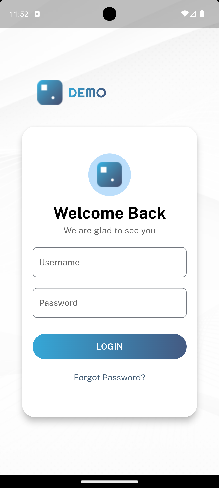

# spring_edge_flutter_assignment

Sample webpage build using flutter. 

## Setup

To run the project:

1. **Clone the repository**:
   ```bash
   git clone https://github.com/Aflah3100/spring_edge_flutter_assignment.git
   cd shoe_mart
   
2. **Install dependencies**:
   ```bash
   flutter pub get
   
3. **Run the Application**:
   ```bash
   flutter run

## Screenshots

### Web View 


### Mobile View 

